# Cuba hurricane trigger — old vs new

Two indicators, AND/OR logic across forecast and observational arms —
replaced by a single population-exposure threshold.

  

Same n = 10 storms triggered over 2002–2025 (RP ≈ 2.6 yrs), same
6 CERF-funded storms caught — but the new method is a single
threshold against one indicator, rather than two AND-gated arms
combined by OR.

---

## How the 64 kt exposure number is computed

For each storm, "people exposed to 64 kt winds" is computed by
overlaying the hurricane's wind footprint on a population map.
Two streams contribute and are combined at each NHC advisory.

  

**Two important details:**

- *Observed exposure is **cumulative**.* Once a populated area has been
  inside the 64-kt wind buffer, those people stay counted for the rest
  of the storm — even after the storm has moved on. This makes the
  observed series monotone non-decreasing through time.
- *Forecast exposure is **forward-only**.* It counts people in the
  wind buffers along the forecast track from now onwards, not back to
  storm genesis. That avoids double-counting the people already in the
  observed series.

The trigger metric is the **peak total exposure** observed at any
single NHC advisory during the storm's lifetime — so a storm that
ramps up gradually and a storm that strengthens suddenly can both
trigger if their peak combined exposure crosses the threshold at any
moment.

---

## How the old trigger was computed

The old trigger combined three separate measurements from two
different data sources — wind speeds (from NHC track data) and
rainfall percentiles (from IMERG observed rainfall). The two arms
were OR-combined: either the forecast arm fired on its own, or
the observational arm fired only when wind *and* rainfall both
crossed their thresholds.

  

A few things to notice about the old method compared with the new one
above:

- **Three measurements** had to land instead of one — peak forecast
  wind, peak observed wind, and a rainfall percentile.
- **Two separate data products** were stitched together (NHC track
  data + IMERG rainfall), each with its own quality, cadence, and
  availability.
- **Two logic gates** (one AND, one OR) replaced a single
  "≥ threshold?" check.

The new method collapses all of this into a single number compared
against a single threshold.

---

Source diagrams live alongside the SVGs in
[`diagrams/`](diagrams/) as Mermaid `.mmd` files. To re-render after
edits:
`npx -y -p @mermaid-js/mermaid-cli mmdc -i diagrams/<name>.mmd -o diagrams/<name>.svg -b transparent`
