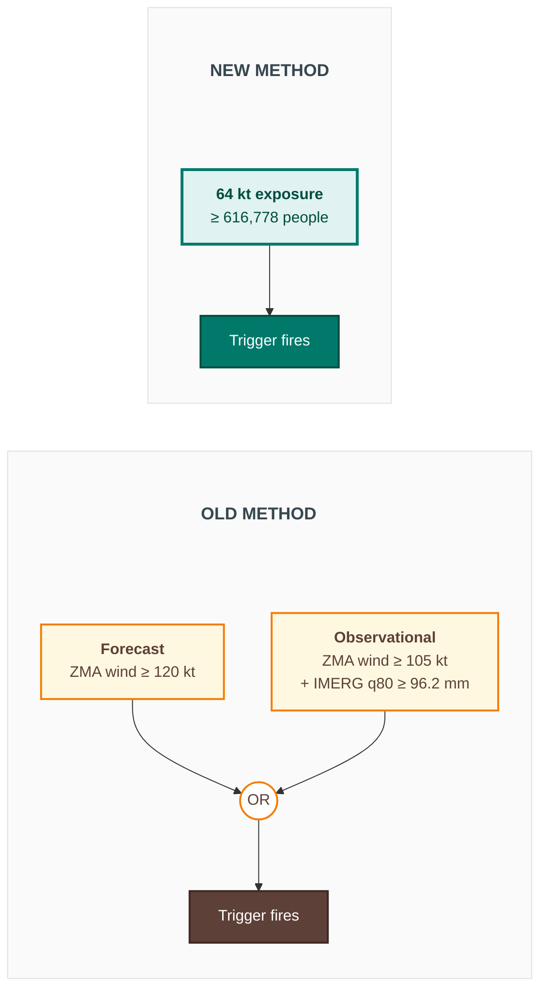

# Cuba hurricane trigger — old vs new

Two indicators, AND/OR logic across forecast and observational arms —
replaced by a single population-exposure threshold.

Same n = 10 storms triggered over 2002–2025 (RP ≈ 2.6 yrs), same
6 CERF-funded storms caught — but the new method is a single
threshold against one indicator, rather than two AND-gated arms
combined by OR.
