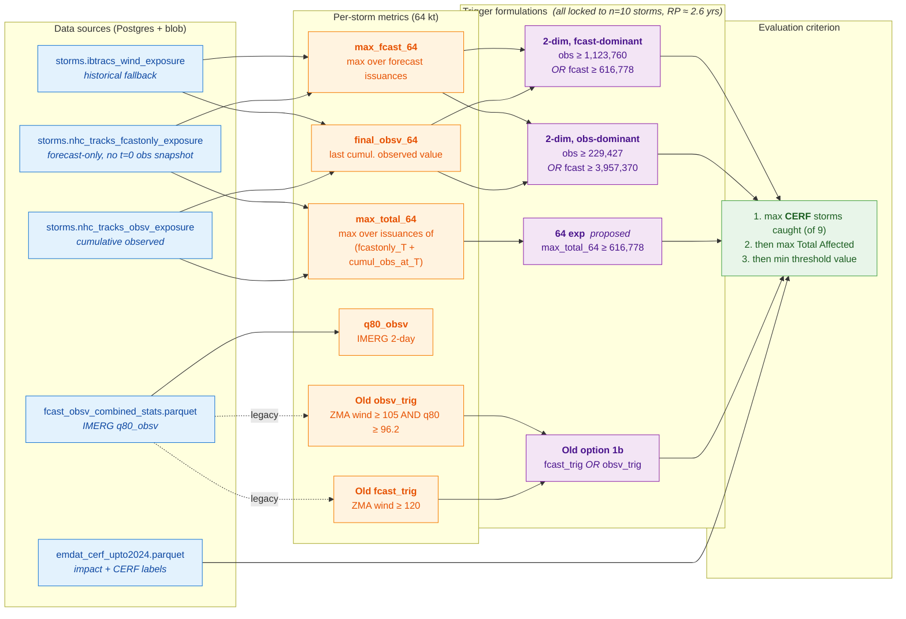

# Cuba hurricane trigger — methodology

End-to-end flow from raw data sources to trigger candidates, as
implemented in `exploration/wsp_trigger.py`.

## Overview

## The n = 10 lock

Every trigger is calibrated to fire on exactly **10 storms** over the
2002–2025 window — a return period of about 2.6 years. With that count
fixed, the optimization searches the threshold space for the
combination that catches the most CERF-funded storms, then maximises
Total Affected (EM-DAT), then takes the lowest (most sensitive)
threshold value.

For triggers with two arms (Old option 1b, both 2-dim variants), the
optimiser sweeps one threshold and sets the other deterministically to
exactly fill the remaining n-quota among storms not already triggered.

## Two methodology notes worth highlighting

### Observed exposure is cumulative-to-date

`storms.nhc_tracks_obsv_exposure.pop_exposed` at each `valid_time` is
the **union** of all wind-radii buffers from storm genesis up to that
time, intersected with population. Verified empirically: across Melissa
2025 and Ian 2022, all wind levels, 50+ data points — zero
non-monotone steps. So `final_obsv_64` = `max(cumul_obs)` = the last
recorded value, and `cummax()` in the code is a defensive no-op rather
than a correction.

### Forecast-only, not forecast-full

`storms.nhc_tracks_fcast_exposure` (the "fcast-full" table) bundles a
snapshot of the **current observed position** into each forecast row.
Summing `fcast_full(T) + cumul_obs(T)` would then double-count that
buffer — once in the forecast, once in the cumulative observed series
that already contains it.

`storms.nhc_tracks_fcastonly_exposure` strips that snapshot. All trigger
computations here use `fcastonly`, matching the convention in the live
alerts pipeline (`monorepo-hurricane-monitoring/ds-storms-alerts`).

Empirical impact of the swap: peak `max_total_64` values drop by 0–80%
across historical storms. For the proposed `64 exp` trigger
specifically, the n=10 threshold moves 697,573 → 616,778, and the
composition of the 10 triggered storms shifts (Rafael 2024 swaps in for
Ian 2022; both CERF).

## Where each piece lives in the notebook

| Block | Cells in `exploration/wsp_trigger.py` |
|---|---|
| Data sources | `load_obsv_exposure`, `load_total_exposure`, `load_storm_meta`, `load_impact`, `load_old_trigger`, `load_max_fcast` |
| Per-storm metrics | `trigger_table` (display), `load_total_exposure` (compute), `load_max_fcast` (compute) |
| `Old option 1b` trigger | `load_old_trigger` |
| `64 exp` trigger optimisation | `rain_trigger_opt` (the `64x exp only` row of the Summary) |
| `2-dim` optimisations | `two_d_64kt_opt` (obs-dominant) and `two_d_64kt_opt_fcast_dom` (fcast-dominant) |
| Head-to-head comparisons | `compare_old_vs_new`, `compare_proposals` |

See [`../review/01_review.md`](../review/01_review.md) for the deeper
code review notes and empirical verification details (review file is
gitignored — local only).
