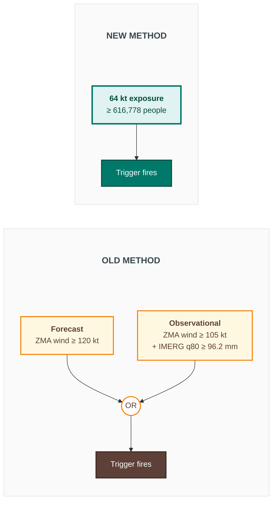
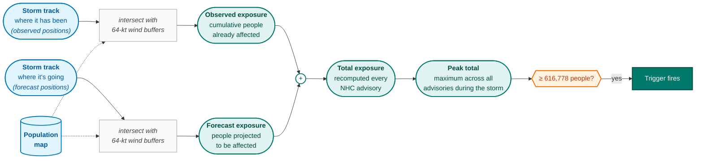

# Cuba hurricane trigger — old vs new

Two indicators, AND/OR logic across forecast and observational arms —
replaced by a single population-exposure threshold.

Same n = 10 storms triggered over 2002–2025 (RP ≈ 2.6 yrs), same
6 CERF-funded storms caught — but the new method is a single
threshold against one indicator, rather than two AND-gated arms
combined by OR.

---

## How the 64 kt exposure number is computed

For each storm, "people exposed to 64 kt winds" is computed by
overlaying the hurricane's wind footprint on a population map.
Two streams contribute and are combined at each NHC advisory.

**Two important details:**

- *Observed exposure is **cumulative**.* Once a populated area has been
  inside the 64-kt wind buffer, those people stay counted for the rest
  of the storm — even after the storm has moved on. This makes the
  observed series monotone non-decreasing through time.
- *Forecast exposure is **forward-only**.* It counts people in the
  wind buffers along the forecast track from now onwards, not back to
  storm genesis. That avoids double-counting the people already in the
  observed series.

The trigger metric is the **peak total exposure** observed at any
single NHC advisory during the storm's lifetime — so a storm that
ramps up gradually and a storm that strengthens suddenly can both
trigger if their peak combined exposure crosses the threshold at any
moment.
