# Cuba hurricane trigger — methodology / metodología

Bilingual write-up of the proposed 64-kt population-exposure trigger
and the historical wind + rainfall trigger it replaces.

- [English](#english)
- [Español](#español)

---

## English

The proposed trigger fires on a single population-exposure threshold.
The historical "option 1b" trigger fired on a logical combination of
forecast wind, observed wind, and observed rainfall. Both are
calibrated to fire on exactly **10 storms over 2002–2025** (return
period ≈ 2.6 years) and catch the same 6 CERF-funded storms — but the
new method gets there with one indicator instead of three.

  

### How the 64 kt exposure number is computed

For each storm, "people exposed to 64 kt winds" is computed by
overlaying the hurricane's wind footprint on a population map. Two
streams contribute — what the storm has already done, and what it is
forecast to do next — combined at each NHC advisory.

  

Two methodological notes worth highlighting:

- *Observed exposure is **cumulative**.* Once a populated area has
  been inside the 64-kt wind buffer, those people stay counted for
  the rest of the storm — even after the storm has moved on. That
  makes the observed series monotone non-decreasing through time.
- *Forecast exposure is **forward-only**.* It counts only people in
  the wind buffers along the forecast track from *now* onward, not
  back to storm genesis. That keeps it disjoint from the observed
  series and avoids double-counting.

The trigger metric is the **peak total exposure** observed at any
single NHC advisory during the storm's lifetime. A storm that ramps
up gradually and a storm that strengthens suddenly can both trigger,
as long as their peak combined exposure crosses the threshold at any
moment.

### How the old trigger was computed

The old trigger combined three separate measurements from two
different data products — wind speeds from NHC track data, and
rainfall percentiles from IMERG observed rainfall. The two arms were
OR-combined: the forecast arm could fire on its own (a strong enough
forecast wind), and the observational arm fired only when observed
wind *and* observed rainfall both crossed their thresholds.

  

Compared to the new method, the old method required:

- **Three measurements** to land instead of one — peak forecast wind,
  peak observed wind, and a rainfall percentile.
- **Two distinct data products** stitched together (NHC track data +
  IMERG rainfall), each with its own quality, cadence and
  availability.
- **Two logic gates** (one AND, one OR) instead of a single
  "≥ threshold?" check.

The new method collapses all of this into a single number compared
against a single threshold.

---

## Español

El trigger propuesto se activa con un solo umbral de exposición de
la población. El trigger histórico ("opción 1b") se activaba con una
combinación lógica de viento pronosticado, viento observado y
precipitación observada. Ambos están calibrados para activarse en
exactamente **10 tormentas durante 2002–2025** (período de retorno
≈ 2,6 años) y capturan las mismas 6 tormentas con financiamiento
CERF — pero el método nuevo lo logra con un solo indicador en vez
de tres.

  

### Cómo se calcula la cifra de exposición a 64 kt

Para cada tormenta, las "personas expuestas a vientos de 64 kt" se
calculan superponiendo la huella de viento del huracán sobre un mapa
de población. Dos flujos contribuyen — lo que la tormenta ya ha
provocado y lo que se pronostica que provocará — combinados en cada
aviso del NHC.

  

Dos detalles metodológicos importantes:

- *La exposición observada es **acumulada**.* Una vez que una zona
  poblada ha estado dentro del buffer de viento de 64 kt, esas
  personas siguen contadas durante el resto de la tormenta — incluso
  después de que la tormenta haya pasado. Por eso la serie observada
  es monótona no decreciente en el tiempo.
- *La exposición pronosticada es **solo hacia adelante**.* Cuenta
  únicamente las personas dentro de los buffers de viento a lo largo
  de la trayectoria pronosticada desde *ahora* en adelante, no desde
  el inicio de la tormenta. Así se mantiene disjunta de la serie
  observada y se evita contar dos veces.

El indicador del trigger es la **exposición total máxima** observada
en cualquier aviso del NHC durante la vida de la tormenta. Una
tormenta que se intensifica gradualmente y una que se intensifica
repentinamente pueden ambas activar el trigger, mientras su
exposición combinada máxima cruce el umbral en algún momento.

### Cómo se calculaba el trigger antiguo

El trigger antiguo combinaba tres mediciones distintas de dos
productos de datos diferentes — velocidades de viento de las
trayectorias del NHC, y percentiles de precipitación de IMERG
observado. Los dos brazos se combinaban con O: el brazo de
pronóstico podía dispararse por sí solo (un viento pronosticado
suficientemente fuerte), y el brazo observacional se disparaba
solo cuando tanto el viento observado *como* la lluvia observada
cruzaban sus umbrales.

  

En comparación con el método nuevo, el método antiguo requería:

- **Tres mediciones** en lugar de una — viento pronosticado máximo,
  viento observado máximo, y un percentil de lluvia.
- **Dos productos de datos distintos** unidos entre sí (trayectorias
  del NHC + precipitación IMERG), cada uno con su propia calidad,
  cadencia y disponibilidad.
- **Dos compuertas lógicas** (una Y, una O) en vez de un solo
  chequeo de "¿≥ umbral?".

El método nuevo colapsa todo esto en un solo número comparado contra
un solo umbral.

---

Source diagrams live alongside the SVGs in
[`diagrams/`](diagrams/) as Mermaid `.mmd` files (the `_es.mmd`
files are the Spanish versions). To re-render after edits:
`npx -y -p @mermaid-js/mermaid-cli mmdc -i diagrams/<name>.mmd -o diagrams/<name>.svg -b transparent`
